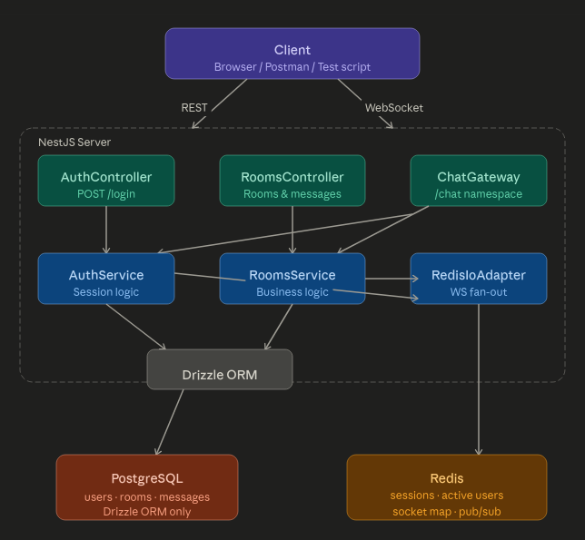

# Architecture

## Overview



### Component Responsibilities

- **AuthController** — `POST /login` only. No auth guard needed.
- **RoomsController** — All room and message REST endpoints. Auth guard applied at controller level.
- **ChatGateway** — Socket.io `/chat` namespace. Validates token on connection, manages room join/leave lifecycle.
- **RoomsService** — Business logic for rooms, messages, and Redis active-user sets.
- **AuthService** — Session creation and validation against Redis.
- **DatabaseModule** — Global Drizzle ORM instance shared across all services.
- **RedisModule** — Two Redis clients: `pub` (read/write) and `sub` (dedicated subscriber).

---

## Session Strategy

1. On `POST /login`, the server looks up or creates the user in PostgreSQL.
2. A 32-character random token is generated via `nanoid`.
3. The token is stored in Redis as `session:<token>` with a **24-hour TTL** (via `SETEX`).
4. The value is the full serialised user object — this avoids a DB round-trip on every authenticated request.
5. On each authenticated request, the `AuthGuard` reads the token from the `Authorization: Bearer` header, calls `GET session:<token>` from Redis, and attaches the user to the request.
6. Tokens are intentionally opaque — no JWT signing or payload — keeping the session store as the single source of truth and enabling easy invalidation by deleting the Redis key.

---

## Redis Pub/Sub WebSocket Fan-Out

Multiple NestJS instances cannot share in-process Socket.io state. The solution uses three separate Redis clients and a custom IO adapter.

### Redis Clients

Three dedicated Redis connections are used to avoid conflicts:

- **`REDIS_CLIENT`** — general read/write operations (session lookup, active user sets, socket metadata)
- **`REDIS_SUB_CLIENT`** — exclusively used by `@socket.io/redis-adapter` for WebSocket scaling
- **`REDIS_EVENT_SUB`** — exclusively subscribes to the `chat:events` channel for internal event fan-out

### Redis IO Adapter

`RedisIoAdapter` extends NestJS's `IoAdapter` and attaches the Socket.io Redis adapter before the server starts. This enables Socket.io to route events across multiple server instances — when one instance calls `server.to(roomId).emit(...)`, the adapter ensures clients connected to other instances also receive the event.

```
main.ts
  → RedisIoAdapter.connectToRedis()   (pub + sub clients)
  → app.useWebSocketAdapter()         (attaches adapter to Socket.io server)
```

### Internal Event Flow

When a REST endpoint needs to broadcast, it publishes a structured JSON event to the `chat:events` Redis channel — it never touches Socket.io directly.

```
POST /rooms/:id/messages
        ↓
   DB save
        ↓
   redis.publish('chat:events', { type: 'message:new', roomId, payload })
        ↓
   ChatGateway (REDIS_EVENT_SUB subscribes in onModuleInit)
        ↓
   server.to(roomId).emit('message:new', payload)
        ↓
   All clients in the room receive the event
```

Same flow applies for `room:deleted` — `RoomsService` publishes `{ type: 'room:deleted', roomId }` and the gateway fans it out to all connected clients in that room.

### Why Separate Clients?

`ioredis` does not allow a client in subscriber mode to issue regular commands. Using `REDIS_EVENT_SUB` only for `subscribe()` and `REDIS_CLIENT` for everything else prevents this conflict.
---

## Active User Tracking

- Each room has a Redis Set at key `room:<roomId>:users`.
- On WebSocket connect → `SADD room:<roomId>:users <username>`
- On WebSocket disconnect or `room:leave` → `SREM room:<roomId>:users <username>`
- `GET /rooms` and `GET /rooms/:id` call `SCARD` to get live counts.
- Socket-to-metadata mapping is stored as `socket:<socketId>` (JSON with `{username, roomId}`) so disconnect handlers can find the right room even if `client.data` is unavailable (e.g. crash recovery).

No in-memory JS Maps or Sets are used for connection state.

---

## Estimated Concurrent User Capacity (Single Instance)

**Assumptions:**
- Server: 2 vCPU, 2 GB RAM (typical free-tier hosting)
- Each WebSocket connection: ~8 KB RAM overhead
- Each Redis operation: ~0.1 ms
- Message throughput: moderate (not a high-frequency trading system)

**Calculation:**

| Resource | Limit | Reasoning |
|----------|-------|-----------|
| RAM | ~50,000 sockets | 2 GB / 40 KB average per connection (including Socket.io buffers, Node heap) |
| CPU | ~10,000 active | Node.js single thread; 10K concurrent active senders before event loop lags |
| Redis connections | Shared pool | Negligible bottleneck at this scale |
| PostgreSQL connections | ~100 | Pg pool default; bottleneck only under heavy write load |

**Estimated safe capacity: ~5,000–10,000 concurrent users** on a single instance with moderate activity.

---

## Scaling to 10×

To handle ~50,000–100,000 concurrent users:

1. **Horizontal scaling** — Run 3–5 NestJS instances behind a load balancer (sticky sessions not required thanks to Redis adapter).
2. **Redis Cluster** — Shard the keyspace; the Redis adapter supports clustered Redis.
3. **PostgreSQL read replicas** — Route `SELECT` queries (message history, room list) to replicas.
4. **Connection pooling** — Add PgBouncer in transaction mode to handle thousands of short-lived DB connections.
5. **Message fan-out optimisation** — For very large rooms, consider room-level sharding or limiting room membership.
6. **Rate limiting** — Add Redis-backed rate limits on `POST /rooms/:id/messages` to prevent abuse.
7. **CDN/Edge** — Static assets and room listings can be cached at the edge.

---

## Known Limitations & Trade-offs

| Limitation | Impact | Mitigation |
|-----------|--------|------------|
| Username-only auth | Impersonation is trivially possible | Acceptable for the spec; add passwords/OAuth for production |
| No message deduplication | Retried POSTs create duplicate messages | Add idempotency keys on the client |
| Active user set uses SADD with username | If a user opens two tabs, SREM on one tab removes them for both | Use socket ID as the set member and map to username for display |
| Session tokens stored as Redis strings | Redis restart without persistence loses all sessions | Enable Redis AOF/RDB persistence in production |
| `before`-cursor pagination uses createdAt comparison | Two messages with the same timestamp could cause skips | Use a composite cursor (createdAt + id) for deterministic ordering |
| No graceful shutdown | In-flight requests dropped on SIGTERM | Add `enableShutdownHooks()` and drain the connection pool |
